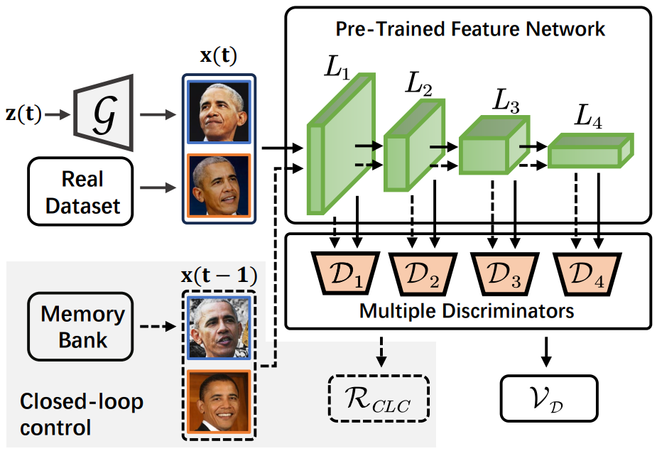
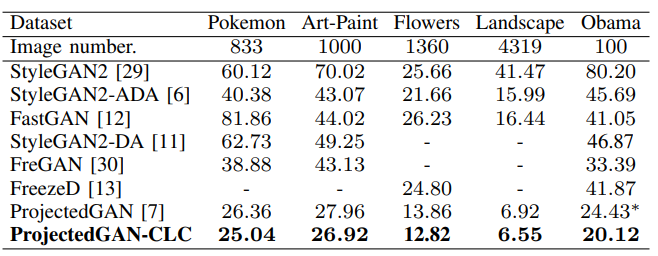

# 📖 Closed Loop Training for Pre-Trained GANs
This repository contains code for our paper 
>**Closed-Loop Training for Projected GAN**<br>
>Jiangwei Zhao, Liang Zhang, Lili Pan, Hongliang Li<br>
>IEEE Signal Processing Letters (submitted)<br>

>**Abstract**:Projected GAN, a pre-trained GAN, has been found to perform well in generating images with only a few training examples. However, it appears that Projected GAN may struggle with extended training, which may lead to decreased performance over time. This is because the discriminator consistently outperforms the generator, creating an unstable training environment. In this work, we propose a solution to this issue by introducing closed-loop control (CLC) into the dynamics of Projected GAN to stabilize training and improve generation. Our proposed method reduced the Frechet Inception Distance of the baseline by 4.31 on the Obama dataset. Our code is available at https://github.com/learninginvision/ProjectedGAN-CLC.
<div align=center>

</div>

## 🔧 Dependencies and Installation
**Dependencies**
- 64-bit Python 3.8
- PyTorch 1.9.0 (or later). See https://pytorch.org for PyTorch install instructions.

**Installation**

First, you can clone this repo using the command:

```shell
git clone https://github.com/learninginvision/InfoUCL
```

Then, you can create a virtual environment using conda, as follows:
```shell
conda env create -f environment.yaml
conda activate pg-clc
```

## 🗺 Data Preparation
For a quick start, you can download the few-shot datasets provided by the authors of [FastGAN](https://github.com/odegeasslbc/FastGAN-pytorch). You can download them [here](https://drive.google.com/file/d/1aAJCZbXNHyraJ6Mi13dSbe7pTyfPXha0/view). To prepare the dataset at the respective resolution, run for example
```
python dataset_tool.py --source=./data/pokemon --dest=./data/pokemon256.zip \
  --resolution=256x256 --transform=center-crop
```
You can get the datasets we used in our paper at their respective websites: 
 [AFHQ](https://github.com/clovaai/stargan-v2), [Landscape](https://www.kaggle.com/arnaud58/landscape-pictures).

## 💻 Training 

Training your own PG-CLC on Pokemon using 2 GPUs:
```
python train.py --outdir=./training-runs/ --cfg=fastgan --data=./data/pokemon256.zip \
  --gpus=2 --batch=64 --mirror=1 --snap=50 --batch-gpu=16 --kimg=10000
```
```--batch``` specifies the overall batch size, ```--batch-gpu``` specifies the batch size per GPU.  

We use a lightweight version of FastGAN (```--cfg=fastgan_lite```). This backbone trains fast regarding wallclock
time and yields better results on small datasets like Pokemon.
Samples and metrics are saved in ```outdir```. To monitor the training progress, you can inspect fid50k_full.json or run tensorboard in training-runs.

## 🔧 Config and Pretrained Models ##
You can change the config of clc on train.py#L240-L243
We provide the following pretrained models (pass the url as `PATH_TO_NETWORK_PKL`):
| Dataset | Loss Weight| Queue Factor | FID | PATH |
|-|:-:|:-:|:-:|:-|
| Pokemon      |  0.1 | 100 | 25.04 | `https://drive.google.com/file/d/18-678PSsr4sYX28qtIkdkOd3TtdpKCWf`|
| Art-Paint |  0.05 | 200 | 26.91 | `https://drive.google.com/file/d/1if_qohz0PYtSzuSlL72nE71oATxuSmVT` |
| Flowers      |  0.05  | 200 | 12.82| `https://drive.google.com/file/d/1B844ooziyOhk3dGbS389XWujIPjTpYbN` |
| landscapes    |  0.05  | 100 | 6.55 | `https://drive.google.com/file/d/1RpDg4vRPgD6UXajzmWDNSuyxkS2F_pwK` |
| Obama        |  0.05  | 100 | 20.12 | `https://drive.google.com/file/d/1A0SbqW3xvHMfWVs_Pp7nUs8Ih5Uj9aYL` |

  
## 📊 Quality Metrics
Per default, ```train.py``` tracks FID50k during training. To calculate metrics for a specific network snapshot, run

```
python calc_metrics.py --metrics=fid50k_full --network=PATH_TO_NETWORK_PKL
```

To see the available metrics, run
```
python calc_metrics.py --help
```
## 📈 Results

<div align="center">


*Results on Pokemon, Art-Paint, Flowers, Landscape and Obama.*
</div>

## 📜Acknowledgments
Our codebase build and extends the awesome [StyleGAN2-ADA repo](https://github.com/NVlabs/stylegan2-ada-pytorch), [ProjectedGAN repo](https://github.com/autonomousvision/projected-gan) and [StyleGAN3 repo](https://github.com/NVlabs/stylegan3)

Furthermore, we use parts of the code of [FastGAN](https://github.com/odegeasslbc/FastGAN-pytorch) and [MiDas](https://github.com/isl-org/MiDaS).
