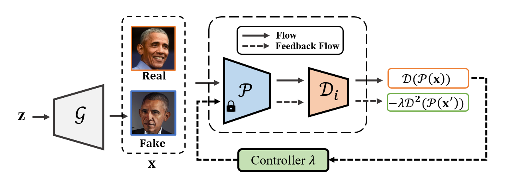

# Closed Loop Training for Pre-Trained GANs
This repository contains code for our paper "Closed Loop Training for Pre-Trained GANs"


## Abstract
  Generative adversarial networks can generate high quality images, but their performance hinges on the availability of abundant image resources. Recent studies indicate superior performance of  Pre-Trained GAN in few-shot image generation, but GAN's training is unstable. This paper analyzes the Pre-Trained GAN using control theory, and incorporates closed loop control to stabilize GAN's training. Notably, we explore the effects of Pre-Trained feature networks on GANs to facilitate high-quality images generation. Furthermore, the closed loop control can be reconsidered in equilibrium views, which is analogous to the local Nash equilibrium of Generative adversarial networks. Our method achieves the high stability and equilibrium of Pre-Trained GAN, thus significantly improving the generated image quality on few-shot datasets.

  author by anonymous. 
  Paper has been submitted.

## Requirements ##
- 64-bit Python 3.8 and PyTorch 1.9.0 (or later). See https://pytorch.org for PyTorch install instructions.
- Use the following commands with Miniconda3 to create and activate your PG Python environment:
  - ```conda env create -f environment.yml```
  - ```conda activate pg-clc```


## Data Preparation ##
For a quick start, you can download the few-shot datasets provided by the authors of [FastGAN](https://github.com/odegeasslbc/FastGAN-pytorch). You can download them [here](https://drive.google.com/file/d/1aAJCZbXNHyraJ6Mi13dSbe7pTyfPXha0/view). To prepare the dataset at the respective resolution, run for example
```
python dataset_tool.py --source=./data/pokemon --dest=./data/pokemon256.zip \
  --resolution=256x256 --transform=center-crop
```
You can get the datasets we used in our paper at their respective websites: 
 [AFHQ](https://github.com/clovaai/stargan-v2), [Landscape](https://www.kaggle.com/arnaud58/landscape-pictures).

## Training ##

Training your own PG-CLC on Pokemon using 2 GPUs:
```
python train.py --outdir=./training-runs/ --cfg=fastgan --data=./data/pokemon256.zip \
  --gpus=2 --batch=64 --mirror=1 --snap=50 --batch-gpu=16 --kimg=10000
```
```--batch``` specifies the overall batch size, ```--batch-gpu``` specifies the batch size per GPU.  

We use a lightweight version of FastGAN (```--cfg=fastgan_lite```). This backbone trains fast regarding wallclock
time and yields better results on small datasets like Pokemon.
Samples and metrics are saved in ```outdir```. To monitor the training progress, you can inspect fid50k_full.json or run tensorboard in training-runs.

## Config and Pretrained Models ##
You can change the config of clc on train.py#LL239C1-L243C63.
We provide the following pretrained models (pass the url as `PATH_TO_NETWORK_PKL`):
| Dataset | Loss Weight| Queue Factor | FID | PATH |
|-|:-:|:-:|:-:|:-|
| Pokémon |  0.1 | 100 | 25.04 | `https://drive.google.com/file/d/18-678PSsr4sYX28qtIkdkOd3TtdpKCWf ` |
| Art-Paint |  0.05 | 200 | 26.91 | ` ` |
| Flowers      |  0.05  | 200 | 12.82| ` ` |
| landscapes    |  0.05  | 100 | 6.55 | ` ` |
| Obama        |  0.05  | 100 | 20.12 | ` ` |

## Quality Metrics ##

Per default, ```train.py``` tracks FID50k during training. To calculate metrics for a specific network snapshot, run

```
python calc_metrics.py --metrics=fid50k_full --network=PATH_TO_NETWORK_PKL
```

To see the available metrics, run
```
python calc_metrics.py --help
```


## Acknowledgments ##
Our codebase build and extends the awesome [StyleGAN2-ADA repo](https://github.com/NVlabs/stylegan2-ada-pytorch), [ProjectedGAN repo](https://github.com/autonomousvision/projected-gan) and [StyleGAN3 repo](https://github.com/NVlabs/stylegan3), both by Karras et al.

Furthermore, we use parts of the code of [FastGAN](https://github.com/odegeasslbc/FastGAN-pytorch) and [MiDas](https://github.com/isl-org/MiDaS).
